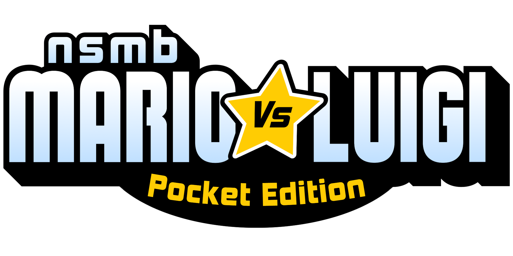

A carefully crafted mobile port of 2.0 NSMB - Mario vs Luigi Online.

This port adds on-screen controls to the game, with many settings for customizing their appearance and behaviour. We also offer builds for Android and iOS!

Apart from that, the defining features of vanilla remain.

## Downloads

Go to the repository's releases or use these shortcuts to the latest builds:

- Not available yet. Still a work in progress!

## Discord
[**Join the discord**](https://discord.gg/dgKVaUKpj5) of the original game to keep up to date with its development, make feature suggestions, report bugs (if you're too lazy to use issues...), get technical support, look for people to play with, and just talk about the game!

## For developers...
Want to use this mobile port as a base for your own creations? Go ahead, fork this repo and clone this branch! Please credit properly.
