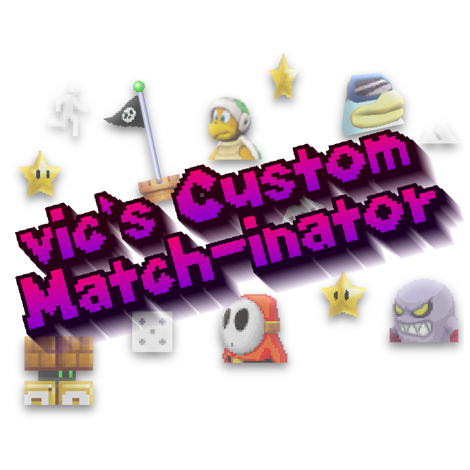

Welcome to the newest vcmi ever! This is a port of the entire mod to MvLO 2.0 with all the bells and whistles! Still a work in progress...

A **standalone mod** of the 2-10 player remake of the Mario vs. Luigi gamemode from New Super Mario Bros. DS.

This mod introduces the concept of *"Match rules"*, a list of conditions that can trigger whatever the lobby's host desires! Win when dying? Get a mega mush when stomping on another player? Uh, sure, if you're into that sort of thing. Oh, it also has a bunch of *"Race maps"* where you can speedrun a classic NSMB level from start to finish!

Apart from that, the defining features of the original remake remain!

## Downloads

Go to the repository's releases or use these shortcuts to the latest builds:

- [**Windows**](https://github.com/vlcoo/VicMvsLO/releases/latest/download/win64-vcmi.zip)
- [**Linux**](https://github.com/vlcoo/VicMvsLO/releases/latest/download/linux-vcmi.zip)
- [**MacOS**](https://github.com/vlcoo/VicMvsLO/releases/latest/download/macos-vcmi.zip)
- [**Android**](https://github.com/vlcoo/VicMvsLO/releases/latest/download/android-vcmi.apk)
- [**Play in browser**](https://vlco-o.itch.io/vics-custom-match-inator) (not recommended)

## Discord
[**Join the discord**](https://discord.gg/dgKVaUKpj5) of the original game to keep up to date with its development, make feature suggestions, report bugs (if you're too lazy to use issues...), get technical support, look for people to play with, and just talk about the game!

## For developers...
This is the **dev** branch of vcmi, which has unfinished features and is generally unstable so beware! Want to use vcmi as a base for your own creations? I recommend you use the [**v17 Cleansed**](https://github.com/vlcoo/VicMvsLO/archive/refs/heads/cleansed-17.zip) branch, which is super clean and stable - ready for modding further! Please credit properly.
