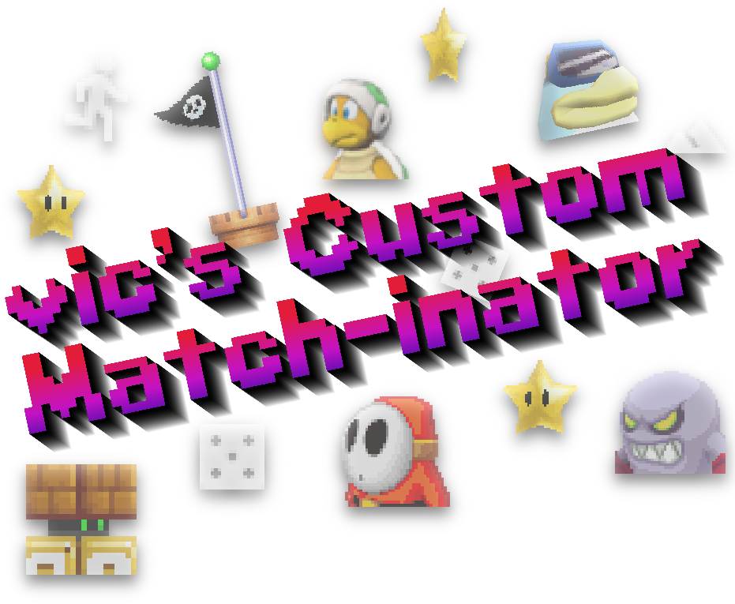

A **standalone mod** of the 2-10 player remake of the Mario vs. Luigi gamemode from New Super Mario Bros. DS.

This mod introduces the concept of *"Match rules"*, a list of conditions that can trigger whatever the lobby's host desires! Win when dying? Get a mega mush when stomping on another player? Uh, sure, if you're into that sort of thing. Oh, it also has around *13 "Race maps"* where you can speedrun a classic NSMB level from start to finish!

Apart from that, the defining features of the original remake remain!

## Downloads

Go to the repository's releases or use these shortcuts to the latest builds:

- [**Windows**](https://github.com/vlcoo/VicMvsLO/releases/latest/download/win64-vcmi.zip)
- [**Linux**](https://github.com/vlcoo/VicMvsLO/releases/latest/download/linux-vcmi.zip)
- [**MacOS**](https://github.com/vlcoo/VicMvsLO/releases/latest/download/macos-vcmi.zip)
- [**Android**](https://github.com/vlcoo/VicMvsLO/releases/latest/download/android-vcmi.apk)
- [**Play in browser**](https://vlco-o.itch.io/vics-custom-match-inator) (not recommended)

## Discord
[**Join the discord**](https://discord.gg/dgKVaUKpj5) of the original game to keep up to date with its development, make feature suggestions, report bugs (if you're too lazy to use issues...), get technical support, look for people to play with, and just talk about the game!

## Default Controls
| Action | Keyboard | Gamepad |
| --- | --- | --- |
| Movement | WASD / Arrow Keys | Left Analog / DPad |
| Jump | Space / Z | A / B Buttons |
| Sprint | Shift / X (hold) | X / Y Buttons (hold) |
| Powerup Action | E / C | RB / RT |
| Reserve Item | Q / V | LB / LT |
| Show Scoreboard | Tab | Select |
| Pause | Escape | Start Button |
| UI Confirm | Left Mouse / Enter / Z | A Button |

  
<h2>Opening in Unity Editor</h2>

Please follow the instructions listed in the [parent repository](https://github.com/ipodtouch0218/NSMB-MarioVsLuigi), but cloning this fork instead.

  
<h2>Credits (original remake)</h2>

### Original Content:
* New Super Mario Bros.
* New Super Mario Bros. Wii
* Super Mario Maker 2

### Contributors:
* [@ipodtouch0218](https://github.com/ipodtouch0218)
* @GradedWarrior
* [@TheMoogle](https://github.com/TheMoogle)
* [@Skillz](https://github.com/Skillz808)
* [@skarph](https://github.com/skarph)
* [@Zest](https://github.com/zestydevy)
* [@kittenchilly](https://github.com/kittenchilly)
* [@Amy54Desu](https://github.com/Amy54Desu)
* [@Kraken](https://github.com/KrakHub)
* [@ShadowWalker13](https://github.com/ShadowWalker13)
* [@GithubSPerez](https://github.com/GithubSPerez)
* [@mindnomad](https://github.com/mindnomad)

### Music:
* [RENREN](https://mistajub.bandcamp.com/)

### QA Testing:
* TheCyVap
* Shadow_Walker13
  
### Level Design:
* Skarph
* TheCyVap
* mindnomad
 
### Rippers:
  
* Demon2Warrior (Background)
* VentureSonic (Background)
* Keira (Background)
* Ohthatguy (Background)
* Poudink (Tiles)
* Someone (Tiles)
* Hiccup (Tiles)
* Jouv (Tiles)
* Mr-SUGOI (Tiles)
* mindnomad (Tiles/Sound)
* Symbolcom (Enemies)
* Mr. C (Enemies)
* Ragey (Enemies)
* Technokami (Enemies)
* A Refracted Swindler (UI)
* Treeki (UI)
* Double S (Models)
* KartMakerBrosU (Models)
* TeridaxXDOO1 (Models)
* Skarph (Models/Sound)
* LukeWarnut (Sound)
* Luke Hackett (Sound)

